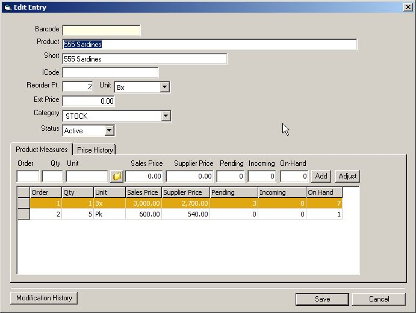



## Advance Inventory System

### Description

This is an advance Inventory System that I've made before. It has a lot of features that you can use in your own program.

Features of this program are as follows:

Purchase order are put on hold prior to final posting.

Purchase/Sales order return.

The system automatically detect if all items in purchase order has been delivered.

Items in listview turns red if all items has been delivered.

Items received under purchase order are still put on hold until it is declared as final received.

The item is not yet added to the inventory if it is on hold.

When the item is put on hold you can still edit it.

Product Measures or Product packaging allows you to record quantity based on packaging.

Record deliveries per city.

Allow you to edit purchase order or sales order on hold.

Receive collection from different customer's invoices and receive only the amount collected from customers.

Assorted product allows you to combine different product which has the same product line and automatically added to the products table.

Products groupings allows you to group different product in one package and automatically added to the products table.

Customers balance monitoring.

This program has an advance features and coding that I did not include in the list of features above. Discover it yourself if you want to use this program.

For instruction on how to run this program please read the readme.html
 
### More Info
 

             |
---                |---
**Submitted On**   |2009-01-25 04:10:16
**By**             |[jaypabs](https://github.com/Planet-Source-Code/PSCIndex/blob/master/ByAuthor/jaypabs.md)
**Level**          |Advanced
**User Rating**    |4.1 (29 globes from 7 users)
**Compatibility**  |VB 6\.0
**Category**       |[Complete Applications](https://github.com/Planet-Source-Code/PSCIndex/blob/master/ByCategory/complete-applications__1-27.md)
**World**          |[Visual Basic](https://github.com/Planet-Source-Code/PSCIndex/blob/master/ByWorld/visual-basic.md)
**Archive File**   |[Advance\_In2141451252009\.zip](https://github.com/Planet-Source-Code/jaypabs-advance-inventory-system__1-71677/archive/master.zip)

